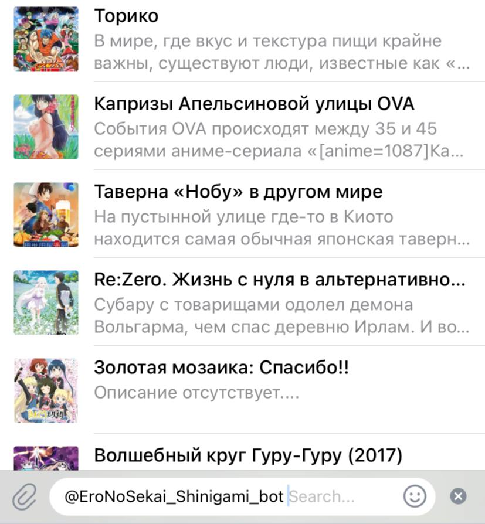

# ✨ Ero no Sekai: Yami no Yokubo - Shinigami

**Shinigami** — это Telegram-бот, созданный для поддержки порядка в чате и развлечения участников с помощью встроенных аниме-функций.  
Он объединяет **инструменты модерации**, **аниме-инфо-систему**, а также **систему пользовательских уровней и рейтинга**.

> Версия: `v1.0 beta`  
> Разработан для закрытой группы  

---

## ⚙️ Быстрый старт

1. Склонируйте репозиторий:
   ```bash
   git clone https://{уникальный_токен}@github.com/MyRequital/Ero-no-Sekai-Shinigami.git
   cd ero-no-sekai-shinigami
   python pip install -r requirements.txt
   ``` 

2. Создайте файл `.env` на основе шаблона:
   ```bash
   cp .env_sample .env
   ```

3. Настройте параметры в:
   - `config.py` — общие настройки работы бота, пути задержки, кол-во предупреждений
   - `log_config.py` — настройка уровня логирования
   

4. Запустите бота и начните работу!

---

## 🛡️ Команды модерации

Shinigami помогает администраторам поддерживать порядок в чате:

| Команда                                        | Описание                                      |
|------------------------------------------------|-----------------------------------------------|
| `/w @user {points=1}`                          | Выдать предупреждение (по умолчанию 1 балл)   |
| `/ban @user {минут}`                           | Забанить пользователя на указанное время      |
| `/rw @user`                                    | Разбанить и сбросить все предупреждения       |
| `/unban @user`                                 | Просто разбанить                              |
| `/scn @user [ник]`                             | Установить чат-ник пользователю               |
| `/set_access @user {уровень}`                  | Назначить уровень доступа                     |
| `/spi + прикрепленное изображение`             | Установка аватарки-чат профиля (себе)         |
| `/spi + прикрепленное изображение {@username}` | Установка аватарки-чат профиля (пользователю) |


### Уровни доступа

```
0-1 — Неподтвержденный юзер
2-7 — обычный пользователь  
8 — администратор  
9 — заместитель владельца  
10 — владелец группы
```

---

## 🎌 Аниме-развлечения

Shinigami умеет развлекать аудиторию подборками и аниме-инфо-каруселями:

| Команда                    | Назначение                                               |
|----------------------------|----------------------------------------------------------|
| `/ssa {название}`          | Карусель по названию аниме                               |
| `/ssag {жанр} {рейтинг=7}` | Карусель по жанру с фильтром рейтинга (по умолчанию 7+)  |
| `/ssc {имя персонажа}`     | Карусель по персонажам (чувствителен к именам)           |

**Поддерживается inline-поиск:**  
Просто введите `@your_bot_name` и часть названия — бот покажет список релевантных тайтлов с возможностью выбора.

---

## 🧑‍💼 Пользовательская информация

| Команда         | Описание                                                 |
|-----------------|----------------------------------------------------------|
| `/me`           | Просмотр своей статистики                                |
| `/whois @user`  | Информация о пользователе: уровень, предупреждения и др. |

---

## 🧰 Дополнительная справка

В любой момент вы можете вызвать:
```
/help
```
Бот отправит список доступных команд и инструкции по использованию.

---

## 👨‍💻 Разработчик

- **Telegram:** [@ZorngeistQual](https://t.me/ZorngeistQual)  
- **Email:** [gunzercin@gmail.com](mailto:gunzercin@gmail.com)

> Бот разрабатывался под нужды конкретного сообщества и может быть адаптирован под другие группы.

---

## 📝 Лицензия

> Нетю :)

---

## 📌 Скриншоты (нажмите что бы просмотреть)

<details>
  <summary>Пример работы inline-запроса</summary>
  
</details>

<details>
  <summary>Пример работы inline-запроса по названию</summary>
  
</details>

## ⭐️ Список всех команд
<details>
<summary><strong>Основные</strong></summary>

| **Команда**             | **Описание** |
|-------------------------|--------------|
| **/start**              |              |
| **/help**               |              |
| **/price_list \| /pl**  |              |
| **/buy_rules \| /br**   |              |
| **/free_rules \| /fr**  |              |
| **/policy**             |              |
| **/genres**             |              |
| **/text_quires \| /tq** |              |
| **/quote**              |              |
| **/translate**          |              |
| **/staff**              |              |

</details>

<details>
<summary><strong>API запросы</strong></summary>

| **Команда**               | **Описание** |
|---------------------------|--------------|
| **/anime_quires \| /aq** |              |

   <details>
   <summary><strong>▶ Работа с Shikimori API</strong></summary>
   
   | **Команда** | **Описание** |
   |-------------|--------------|
   | **/ssra**   |              |
   | **/ssa**    |              |
   | **/ssag**   |              |
   | **/ssc**    |              |
   
   </details>
   
   <details>
   <summary><strong>▶ Работа с Anilist API</strong></summary>
   
   | **Команда** | **Описание** |
   |-------------|--------------|
   | **/asra**   |              |
   | **/asa**    |              |
   
   </details>

</details>

<details>
<summary><strong>Работа с профилем</strong></summary>

| **Команда**                    | **Описание** |
|--------------------------------|--------------|
| **/me**                        |              |
| **/whois**                     |              |
| **/set_chat_nickname \| /scn** |              |
| **/set_admin_note \| /san**    |              |
| **/set_profile_icon \| /spi**  |              |

</details>

<details>
<summary><strong>Администрирование</strong></summary>

| **Команда**     | **Описание** |
|-----------------|--------------|
| **/ban**        |              |
| **/unban**      |              |
| **/rw**         |              |
| **/w**          |              |
| **/set_access** |              |

</details>

## ⭐ Поддержка

Если вам понравился проект, не забудьте поставить звезду на GitHub и подписаться на разработчика.
